# Ответы на экзамен по физике

## Оглавление

### Темы
- [1. Магнитное поле. Электромагнитная индукция](#тема-1-магнитное-поле-электромагнитная-индукция)
- [2. Основы теории Максвелла. Электромагнитные волны](#тема-2-основы-теории-максвелла-электромагнитные-волны)
- [3. Волновая оптика](#тема-3-волновая-оптика)
- [4. Квантовая природа излучения](#тема-4-квантовая-природа-излучения)
- [5. Элементы квантовой физики](#тема-5-элементы-квантовой-физики)

## Тема 1. Магнитное поле. Электромагнитная индукция

### 1. Магнитное поле и его характеристики. Закон Био-Савара-Лапласа и его применение к расчету магнитного поля

Магнитное поле создаётся движущимися зарядами и электрическими токами. Оно действует на движущиеся заряды, проводники с током и магнитные моменты частиц. Главные характеристики поля: магнитная индукция $\vec{B}$ и напряжённость $\vec{H}$. Магнитная индукция показывает силовое действие поля, а напряжённость особенно удобна при описании поля в веществе. Для вакуума:

$$
\vec{B}=\mu_0\vec{H}.
$$

где $\vec{B}$ — магнитная индукция, $\vec{H}$ — напряжённость магнитного поля, $\mu_0$ — магнитная постоянная.

Линии магнитного поля замкнуты, поэтому у магнитного поля нет отдельных источников, как у электрического поля.

Закон Био-Савара-Лапласа позволяет находить поле, создаваемое элементом тока:

$$
d\vec{B}=\frac{\mu_0}{4\pi}\frac{I[d\vec{l}\times \vec{r}]}{r^3}.
$$

где $I$ — сила тока, $d\vec{l}$ — элемент проводника, $\vec{r}$ — радиус-вектор к точке наблюдения, $r$ — его модуль, $\mu_0$ — магнитная постоянная.

Для модуля:

$$
dB=\frac{\mu_0}{4\pi}\frac{I\,dl\,\sin\alpha}{r^2}.
$$

где $dB$ — модуль элементарного магнитного поля, $dl$ — длина элемента проводника, $\alpha$ — угол между $d\vec{l}$ и $\vec{r}$.

Из него получают важные формулы. Для бесконечно длинного прямого проводника:

$$
B=\frac{\mu_0 I}{2\pi r}.
$$

где $B$ — магнитная индукция, $I$ — ток, $r$ — расстояние до проводника.

Для поля в центре кругового витка:

$$
B=\frac{\mu_0 I}{2R}.
$$

где $R$ — радиус кругового витка.

Для длинного соленоида:

$$
B=\mu_0 nI.
$$

где $n$ — число витков на единицу длины, $I$ — ток в соленоиде.

Физический смысл закона очень простой: чем больше ток, тем сильнее поле; чем дальше точка от проводника, тем слабее поле.

### 2. Закон Ампера. Взаимодействие параллельных токов. Магнитная постоянная $\mu_0$. Единицы измерения магнитной индукции и напряженности магнитного поля

Закон Ампера описывает действие магнитного поля на проводник с током. Для элемента тока:

$$
d\vec{F}=I[d\vec{l}\times \vec{B}].
$$

где $d\vec{F}$ — сила, действующая на элемент проводника, $I$ — ток, $d\vec{l}$ — элемент длины, $\vec{B}$ — магнитная индукция.

Для прямого проводника длины $l$ в однородном поле:

$$
F=BIl\sin\alpha.
$$

где $F$ — сила Ампера, $B$ — магнитная индукция, $I$ — ток, $l$ — длина проводника, $\alpha$ — угол между направлением тока и полем.

Если проводник перпендикулярен полю, то $F=BIl$. Направление силы определяют по правилу левой руки.

Если рядом расположены два длинных параллельных проводника с током, они взаимодействуют. Токи в одном направлении притягиваются, в противоположных направлениях отталкиваются. Сила взаимодействия на единицу длины:

$$
\frac{F}{l}=\frac{\mu_0 I_1I_2}{2\pi r}.
$$

где $F/l$ — сила взаимодействия на единицу длины, $I_1$ и $I_2$ — токи в проводниках, $r$ — расстояние между ними.

Магнитная постоянная:

$$
\mu_0=4\pi\cdot 10^{-7}\ \text{Гн/м}.
$$

где $\mu_0$ — магнитная постоянная в вакууме.

Она входит в законы магнитного поля в вакууме. Единица магнитной индукции:

$$
[B]=\text{Тл},
$$

где Тл — тесла, единица магнитной индукции.

а единица напряжённости:

$$
[H]=\text{А/м}.
$$

где А/м — ампер на метр, единица напряжённости магнитного поля.

### 3. Магнитное поле движущегося заряда. Действие магнитного поля на движущийся заряд. Движение заряженных частиц в магнитном поле

Любой движущийся заряд создаёт магнитное поле. Если такой заряд попадает во внешнее магнитное поле, на него действует сила Лоренца:

$$
\vec{F}=q(\vec{v}\times \vec{B}),
$$

где $q$ — заряд частицы, $\vec{v}$ — её скорость, $\vec{B}$ — магнитная индукция.

а её модуль равен

$$
F=qvB\sin\alpha.
$$

где $F$ — модуль силы Лоренца, $v$ — модуль скорости, $\alpha$ — угол между $\vec{v}$ и $\vec{B}$.

Сила Лоренца всегда перпендикулярна скорости частицы, поэтому она не меняет модуль скорости, а меняет только направление движения.

Если частица движется вдоль поля, сила равна нулю, и траектория остаётся прямой. Если частица влетает перпендикулярно полю, она движется по окружности:

$$
qvB=\frac{mv^2}{r},\qquad r=\frac{mv}{qB}.
$$

где $m$ — масса частицы, $r$ — радиус траектории.

Период обращения:

$$
T=\frac{2\pi m}{qB}.
$$

где $T$ — период обращения частицы в магнитном поле.

Если скорость направлена под углом к полю, движение становится винтовым.

### 4. Ускорители заряженных частиц в магнитном поле

В ускорителях магнитное поле не увеличивает энергию частицы напрямую, а управляет её траекторией. Разгон выполняет электрическое поле, а магнитное поле искривляет движение и удерживает частицы в нужной области. На этом основана работа циклотронов, синхротронов и других ускорителей.

В циклотроне частица движется по спирали с растущим радиусом, потому что её скорость увеличивается, а магнитное поле продолжает закручивать траекторию. В синхротронах одновременно меняют параметры поля и ускоряющего напряжения, чтобы удерживать очень быстрые частицы на почти постоянной орбите.

### 5. Эффект Холла

Если проводник или полупроводник с током поместить в магнитное поле, носители заряда отклоняются в сторону под действием силы Лоренца. На боковых гранях возникает поперечная разность потенциалов, называемая напряжением Холла.

Как это происходит

Представим металлическую пластинку.
Ток течёт вправо.
Магнитное поле направлено вглубь листа.

1. Электроны движутся

Ток существует потому, что внутри движутся носители заряда.
У электронов есть скорость.

2. Появляется сила Лоренца

На каждый электрон действует магнитная сила
Она отклоняет электроны к одной боковой стенке.

3. Заряды накапливаются
На одной стороне проводника появляется избыток электронов: -
На другой стороне остаётся недостаток электронов: +

4. Возникает электрическое поле

Разделение зарядов создаёт электрическое поле внутри проводника.
Это поле направлено от плюса к минусу.

5. Наступает равновесие

Электрическая сила

$$
F_{\text{эл}} = qE
$$

начинает противодействовать силе Лоренца

$$
F_{\text{м}} = qvB
$$

В состоянии равновесия:

$$
qE = qvB
$$

После сокращения заряда \(q\) получаем:

$$
E = vB
$$

Эффект Холла очень важен практически. Он позволяет определить знак носителей заряда, их концентрацию и использовать вещество как датчик магнитного поля. Особенно часто этот эффект применяют в полупроводниках.

### 6. Циркуляция вектора магнитного поля в вакууме. Магнитные поля соленоида и тороида

Циркуляция вектора напряжённости магнитного поля по замкнутому контуру определяется полным током, охваченным этим контуром:

$$
\oint \vec{H}\cdot d\vec{l}=I_{\text{охв}}.
$$

где интеграл берётся по замкнутому контуру, $I_{\text{охв}}$ — полный ток, охваченный контуром.

Это закон полного тока. Он особенно удобен при расчёте симметричных полей.

Для длинного соленоида:

$$
H=nI,\qquad B=\mu_0 nI.
$$

где $H$ — напряжённость поля в соленоиде, $B$ — индукция, $n$ — число витков на единицу длины, $I$ — ток.

Поле внутри соленоида почти однородно, а снаружи слабо. Для тороида:

$$
B=\frac{\mu_0 N I}{2\pi r}.
$$

где $N$ — число витков тороида, $r$ — расстояние до его оси.

Поле тороида сосредоточено в основном внутри его объёма.

### 7. Поток вектора магнитной индукции $\Phi_B$. Теорема Гаусса для поля. Потокосцепление $\Psi$

Магнитный поток — это физическая величина, которая показывает, сколько линий магнитного поля пронизывает заданную площадь. Проще говоря, это мера общего количества магнетизма, проходящего сквозь определенный контур или поверхность.

Магнитный поток через поверхность определяется формулой:

$$
\Phi_B=\int_S \vec{B}\cdot d\vec{S}.
$$

где $\Phi_B$ — магнитный поток через поверхность $S$, $d\vec{S}$ — вектор элементарной площадки.

Если поле однородно, то

$$
\Phi_B=BS\cos\alpha.
$$

где $S$ — площадь поверхности, $\alpha$ — угол между $\vec{B}$ и нормалью к поверхности.

Теорема Гаусса для магнитного поля:

$$
\oint_S \vec{B}\cdot d\vec{S}=0.
$$

где нулевой результат означает, что полный магнитный поток через любую замкнутую поверхность равен нулю.

Это значит, что линии магнитного поля замкнуты: сколько линий входит в замкнутую поверхность, столько и выходит. Для катушки с $N$ витками потокосцепление равно

$$
\Psi=N\Phi_B.
$$

где $\Psi$ — потокосцепление, $N$ — число витков, $\Phi_B$ — магнитный поток через один виток.

Потокосцепление — это суммарный магнитный поток, сцепленный со всеми витками контура или катушки. Если каждый виток пронизывает один и тот же поток, то потокосцепление равно произведению числа витков на поток через один виток. Эта величина важна в явлениях индукции и самоиндукции, потому что именно изменение потокосцепления приводит к возникновению ЭДС.

### 8. Работа по перемещению проводника и контура с током в магнитном поле

На проводник с током в магнитном поле действует сила Ампера, поэтому при перемещении проводника возможна механическая работа. Для замкнутого контура важен его магнитный момент:

$$
\vec{p}_m=I\vec{S}.
$$

где $\vec{p}_m$ — магнитный момент контура, $I$ — ток, $\vec{S}$ — вектор площади контура.

На контур действует момент сил:

$$
\vec{M}=[\vec{p}_m\times \vec{B}].
$$

где $\vec{M}$ — момент сил, действующий на контур.

Потенциальная энергия контура:

$$
W=-\vec{p}_m\cdot \vec{B}.
$$

где $W$ — потенциальная энергия контура в магнитном поле.

Контур стремится повернуться так, чтобы его магнитный момент совпал по направлению с полем. Именно на этом основана работа рамки с током в измерительных приборах и электродвигателях.

### 9. Явление электромагнитной индукции (опыты Фарадея). Закон Фарадея и его вывод из закона сохранения энергии

Фарадей установил, что в контуре возникает индукционный ток, если магнитный поток через этот контур изменяется. Ток появляется при движении магнита, изменении силы тока в соседней катушке, изменении площади контура или его ориентации в поле.

ЭДС индукции — это электродвижущая сила, возникающая в контуре при изменении магнитного потока через него. По смыслу это работа сторонних сил по перемещению единичного положительного заряда по замкнутому контуру.

Закон Фарадея:

$$
\varepsilon_i=-\frac{d\Phi}{dt}.
$$

где $\varepsilon_i$ — ЭДС индукции, $\Phi$ — магнитный поток, $t$ — время.

Знак минус выражает правило Ленца: индукционный ток всегда направлен так, чтобы противодействовать изменению магнитного потока. Это связано с законом сохранения энергии. Если бы индукционный ток усиливал причину своего появления, энергия возникала бы "сама собой".

При изменении магнитного потока через замкнутый проводящий контур возникает ЭДС индукции ($\varepsilon_i$), вызывающая индукционный ток (I).

За малое время (dt) через поперечное сечение проводника проходит заряд

$$
dq=Idt.
$$

Работа сторонних сил по перемещению этого заряда равна

$$
dA=\varepsilon_i dq.
$$

Подставляя выражение для заряда, получаем

$$
dA=\varepsilon_i Idt.
$$

Согласно закону сохранения энергии, работа сторонних сил совершается за счёт уменьшения энергии магнитного поля:

$$
dA=-dW_m,
$$

где (W_m) — энергия магнитного поля.

Изменение энергии магнитного поля связано с изменением магнитного потока соотношением

$$
dW_m=Id\Phi.
$$

Тогда

$$
\varepsilon_i Idt=-Id\Phi.
$$

Сокращая на (I), получаем

$$
\varepsilon_i dt=-d\Phi.
$$

Разделив обе части на (dt), получаем закон электромагнитной индукции Фарадея:

$$
\boxed{\varepsilon_i=-\frac{d\Phi}{dt}}.
$$

Знак минус соответствует правилу Ленца и показывает, что индукционный ток всегда направлен так, чтобы противодействовать изменению магнитного потока, вызвавшему его появление.

### 10. Вращение рамки в магнитном поле. Генераторы

Если рамка вращается в однородном магнитном поле, поток через неё периодически меняется:

$$
\Phi=BS\cos\omega t.
$$

где $\omega$ — циклическая частота вращения рамки, $t$ — время.

Тогда в рамке возникает ЭДС индукции:

$$
\varepsilon=NBS\omega\sin\omega t.
$$

где $\varepsilon$ — ЭДС индукции, $N$ — число витков рамки.

Это синусоидальная ЭДС, поэтому вращающаяся рамка является простейшей моделью генератора переменного тока. В генераторе механическая энергия вращения превращается в электрическую.

### 11. Вихревые токи (токи Фуко)

Вихревые токи возникают вследствие явления электромагнитной индукции. При изменении магнитного потока в массивном проводнике индуцируется ЭДС, которая вызывает появление замкнутых токов внутри объёма проводника.

Направление токов Фуко определяется правилом Ленца: создаваемое ими магнитное поле противодействует изменению внешнего магнитного потока, вызвавшему их появление.

Мощность тепловых потерь, вызванных вихревыми токами, возрастает с увеличением частоты изменения магнитного поля и электропроводности материала.

Для уменьшения вихревых токов сердечники трансформаторов, электрических машин и других устройств изготавливают не сплошными, а из тонких изолированных друг от друга пластин электротехнической стали. Это увеличивает сопротивление путям протекания токов Фуко и уменьшает потери энергии.

Токи Фуко используются в индукционных печах для нагрева металлов, в электромагнитных тормозах, металлоискателях, индукционных счётчиках и устройствах неразрушающего контроля материалов.

### 12. Индуктивность контура. Самоиндукция. Токи при размыкании и замыкании цепи

Индуктивность показывает, насколько сильно контур препятствует изменению тока. Если ток создаёт потокосцепление

$$
\Psi=LI,
$$

где $L$ — индуктивность контура, $I$ — ток.

то при изменении тока возникает ЭДС самоиндукции:

$$
\varepsilon_{si}=-L\frac{dI}{dt}.
$$

где $\varepsilon_{si}$ — ЭДС самоиндукции, $dI/dt$ — скорость изменения тока.

При замыкании цепи ток возрастает не мгновенно, а постепенно (Ток начинает расти, возникает ЭДС самоиндукции, направленная против источника, поэтому постепенно). При размыкании он тоже не исчезает сразу, а ЭДС самоиндукции старается его поддержать (по правилу Ленца). Поэтому при размыкании катушек часто возникает искра.

### 13. Взаимная индукция. Трансформаторы

Если изменение тока в одном контуре вызывает ЭДС в другом, явление называется взаимной индукцией. ЭДС взаимной индукции записывают так:

$$
\varepsilon=-M\frac{dI}{dt},
$$

где $M$ — коэффициент взаимной индукции.

На этом явлении основана работа трансформатора. Переменный ток в первичной обмотке создаёт меняющийся магнитный поток, который индуцирует ЭДС во вторичной обмотке. Для идеального трансформатора:

$$
\frac{U_1}{U_2}=\frac{N_1}{N_2}.
$$

где $U_1$ и $U_2$ — напряжения на первичной и вторичной обмотках, $N_1$ и $N_2$ — числа витков.

### 14. Энергия магнитного поля. Аналогия при рассмотрении электрических и магнитных полей

Если в катушке течёт ток, её магнитное поле содержит энергию:

$$
W=\frac{LI^2}{2}.
$$

где $W$ — энергия магнитного поля катушки, $L$ — индуктивность, $I$ — ток.

Плотность энергии магнитного поля в вакууме можно записать как

$$
w=\frac{B^2}{2\mu_0}.
$$

где $w$ — объёмная плотность энергии магнитного поля.

Аналогия такая: как электрическое поле хранит энергию, например в конденсаторе, так магнитное поле хранит энергию в катушке индуктивности. Поэтому электрические и магнитные поля удобно рассматривать как две формы существования единого электромагнитного поля.

### 15. Магнитные моменты электронов и атомов. Диа- и парамагнетизм

Магнитные свойства атомов связаны с движением электронов вокруг ядра и со спином электронов. Поэтому электрон и атом могут иметь магнитный момент.

Диамагнетики намагничиваются против внешнего поля и поэтому слегка выталкиваются из сильного магнитного поля. Парамагнетики имеют собственные магнитные моменты атомов, которые во внешнем поле частично ориентируются по полю, поэтому такие вещества немного усиливают магнитное поле внутри себя.

### 16. Намагниченность. Магнитное поле в веществе

Намагниченность $\vec{J}$ показывает магнитный момент единицы объёма вещества. Для слабых полей обычно пишут:

$$
\vec{J}=\chi \vec{H},
$$

где $\vec{J}$ — намагниченность, $\chi$ — магнитная восприимчивость (показывает, насколько легко вещество намагничивается под действием внешнего магнитного поля), $\vec{H}$ — напряжённость поля.

Поле в веществе описывают формулой

$$
\vec{B}=\mu_0(\vec{H}+\vec{J}).
$$

где $\vec{J}$ учитывает вклад вещества в магнитное поле.

Если среда линейная, то:

$$
\vec{B}=\mu_0\mu\vec{H}.
$$

где $\mu$ — относительная магнитная проницаемость вещества.

### 17. Условия на границе двух магнетиков

На границе двух магнитных сред поле подчиняется определённым граничным условиям. Нормальная составляющая магнитной индукции непрерывна:

$$
B_{1n}=B_{2n}.
$$

где индексы $1$ и $2$ относятся к двум средам, а $n$ означает нормальную составляющую.

Магнитные линии не обрываются на границе

Если на границе нет поверхностного тока, то непрерывна и тангенциальная составляющая напряжённости:

$$
H_{1\tau}=H_{2\tau}.
$$

где $\tau$ обозначает тангенциальную составляющую поля.

Вдоль границы магнитное поле не испытывает скачка (если нет поверхностного тока)

Физически это означает, что магнитное поле не обрывается на границе, а переходит из одной среды в другую по строгим правилам.

### 18. Ферромагнетики и их свойства. Природа ферромагнетизма

Ферромагнетики намагничиваются очень сильно даже в сравнительно слабом поле. К ним относятся железо, кобальт, никель и некоторые сплавы. Для них характерны большая магнитная проницаемость, остаточная намагниченность и гистерезис.

Природа ферромагнетизма связана с существованием доменов — областей, где магнитные моменты атомов ориентированы одинаково. Во внешнем поле домены, ориентированные по полю, увеличиваются, из-за чего вещество быстро намагничивается. При нагреве выше точки Кюри ферромагнитные свойства исчезают.

---

## Тема 2. Основы теории Максвелла. Электромагнитные волны

### 19. Вихревое электрическое поле

Вихревое электрическое поле — это электрическое поле, силовые линии которого замкнуты. В отличие от электростатического поля, его источником являются не неподвижные электрические заряды, а изменяющееся во времени магнитное поле.

Именно вихревое электрическое поле создаёт ЭДС индукции в замкнутом контуре. Переменное магнитное поле порождает вихревое электрическое поле. Попадая в это поле, свободные заряженные частицы (электроны) в замкнутом проводнике начинают упорядоченно двигаться. Это движение создает индукционный ток.

### 20. Ток смещения

Чтобы сделать законы электромагнетизма согласованными, Максвелл ввёл понятие тока смещения. Он связан не с движением зарядов, а с изменением электрического поля.

Формула ерез электрический поток:

$$
I_{\text{см}}=\varepsilon_0\frac{d\Phi_E}{dt}
$$

где $\varepsilon_0$ — электрическая постоянная, а $\Phi_E$ — поток вектора напряжённости электрического поля. D - вектор электрического смещения

Ток смещения особенно важен в конденсаторе при переменном токе. Между пластинами нет проводящего тока, но изменяющееся электрическое поле создаёт такой же магнитный эффект, как и обычный ток в проводнике.

### 21. Уравнения Максвелла для электромагнитного поля в интегральной и дифференциальной форме

Уравнения Максвелла являются основными уравнениями электродинамики. Они описывают взаимосвязь электрического и магнитного полей, а также их связь с электрическими зарядами и токами.

1. Теорема Гаусса для электрического поля

Интегральная форма:

$$
\oint\limits_S \vec{D}\cdot d\vec{S}=Q.
$$

Дифференциальная форма:

$$
\nabla \cdot \vec D = \rho
$$

где $Q$ — заряд внутри замкнутой поверхности, $\rho$ — объёмная плотность заряда.

Физический смысл: источниками электрического поля являются электрические заряды.
Сколько заряда внутри поверхности, столько электрического поля из неё выходит.

2. Теорема Гаусса для магнитного поля

Интегральная форма:

$$
\oint\limits_S \vec{B}\cdot d\vec{S}=0.
$$

Дифференциальная форма:

$$
\nabla \cdot \vec B = 0
$$

Физический смысл: магнитных зарядов не существует, линии магнитного поля всегда замкнуты.

3. Закон электромагнитной индукции Фарадея

Интегральная форма:

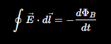

Дифференциальная форма:

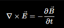

где E - напряжённость электрического поля

Физический смысл: изменяющееся магнитное поле создаёт вихревое электрическое поле.

4. Закон полного тока (обобщённый закон Ампера–Максвелла)

Интегральная форма:

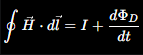

Дифференциальная форма:

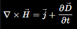

где $\vec j$ — плотность тока проводимости, H - напряжённость магнитного поля

Физический смысл: магнитное поле создаётся как электрическим током, так и изменяющимся электрическим полем (током смещения).

### 22. Экспериментальное получение электромагнитных волн. Шкала электромагнитных волн

Электромагнитные волны впервые экспериментально получил Герц. Он показал, что быстро изменяющиеся токи создают волны, которые распространяются в пространстве и обладают всеми свойствами (распространение в вакууме, отражение, преломление, интерфенция - способность волн накладываться друг на друга, дифракция - огибание электромагнитными волнами препятствий, поляризация - выделение определнного направления колебаний векторов поля, дисперсия - зависимость скорости волны от ее частоты (или длины), поглощение и рассеивание), предсказанными теорией Максвелла.

Исторически доказавший теорию Максвелла опыт заключался в следующем:
- Использовался вибратор Герца (два металлических стержня с небольшим воздушным зазором между ними).
- При подаче высокого напряжения на стержни возникал электрический искровой разряд.
- В момент пробоя заряд совершал колебания, что создавало мощное переменное электромагнитное поле.
- В качестве приемника выступал второй разомкнутый проволочный виток с искровым промежутком — в нем индуцировались токи, вызывающие ответную искру.

Электромагнитная шкала включает радиоволны, микроволны, инфракрасное излучение, видимый свет, ультрафиолет, рентгеновские и гамма-лучи. Все они имеют одну и ту же природу и отличаются в основном длиной волны и частотой. Между длиной волны и частотой существует обратная зависимость.

### 23. Дифференциальное уравнение электромагнитной волны

Из уравнений Максвелла выводится волновое уравнение для электрического и магнитного полей. Оно описывает распространение электрического и магнитного полей в пространстве и времени. Например, для электрического поля:

$$
\frac{\partial^2 \vec{E}}{\partial x^2}=\frac{1}{v^2}\frac{\partial^2 \vec{E}}{\partial t^2}.
$$

где $\vec{E}$ — напряжённость электрического поля, $v$ — скорость распространения волны, $x$ — координата, $t$ — время.

Аналогичное уравнение выполняется и для $\vec{B}$. Это значит, что электромагнитное возмущение распространяется как волна. В вакууме скорость равна:

$$
c=\frac{1}{\sqrt{\mu_0\varepsilon_0}}.
$$

где $c$ — скорость света в вакууме, $\mu_0$ — магнитная постоянная, $\varepsilon_0$ — электрическая постоянная.

### 24. Энергия и импульс электромагнитной волны. Вектор Умова-Пойтинга

Электромагнитная волна переносит энергию и импульс.

Плотность энергии электромагнитной волны:

$$
w=w_E+w_B
$$

где

$$
w_E=\frac{\varepsilon_0E^2}{2}
$$

— плотность энергии электрического поля,

$$
w_B=\frac{B^2}{2\mu_0}
$$

— плотность энергии магнитного поля.

Для плоской электромагнитной волны:

$$
w_E=w_B
$$

Поэтому полная плотность энергии:

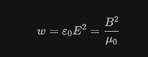

Импульс электромагнитной волны:

$$
p=\frac{W}{c}
$$

где $p$ — импульс волны, $W$ — её энергия, $c$ — скорость света.

 Направление переноса энергии определяется вектором Умова-Пойтинга:

$$
\vec{S}=[\vec{E}\times \vec{H}].
$$

где $\vec{S}$ — вектор Умова-Пойтинга, показывающий направление и плотность потока энергии.

Он направлен туда же, куда распространяется волна. Раз свет переносит импульс, он может оказывать давление на поверхность. Это и есть давление света.

### 25. Излучение диполя. Применение электромагнитных волн

Электрический диполь — это система из двух одинаковых по модулю зарядов противоположного знака.

Если электрический диполь колеблется, он излучает электромагнитные волны. Это простейшая модель излучателя и основа понимания работы антенн.

Электромагнитные волны применяются почти во всех разделах современной техники: радиосвязь, телевидение, мобильная связь, Wi-Fi, радиолокация, медицина, микроволновый нагрев, зрение, лазерная техника. 

---

## Тема 3. Волновая оптика

### 26. Развитие представлений о природе света. Принцип Гюйгенса. Корпускулярно-волновая теория света. Когерентность и монохроматичность световых волн

Исторически свет сначала рассматривали как поток частиц, затем Гюйгенс предлположил, что свет представляет собой волну. В начале XX века выяснилось, что существует фотоэффект, который невозможно объяснить волнами. Максвелл показал, что свет - электромагнитная волна. Эйнштейн предложил: свет испускается и поглощается квантами - фотонами.

Принцип Гюйгенса утверждает, что каждая точка волнового фронта является источником вторичных волн, а новая поверхность, огибающая их, задаёт следующий волновой фронт.

Современная физика рассматривает свет как объект с двойственной природой: он проявляет и волновые, и корпускулярные свойства. Волновые свойства - интерференция, дифракция, поляризация. Корпускулярные - фотоэффект, тепловое излучение.

Чтобы появилась интерференция, волны должны быть когерентными. Когерентными называются волны одинаковой частоты и с постоянной разностью фаз, а монохроматические - волны одинаковой частоты.

### 27. Интерференция света. Методы наблюдения интерференции света

Интерференция — это перераспределение интенсивности света при наложении когерентных волн. В одних точках волны усиливают друг друга, а в других ослабляют.

Условия максимумов и минимумов:

$$
\Delta=m\lambda,
$$

где $\Delta$ — разность хода волн, $m$ — целое число, $\lambda$ — длина волны.

$$
\Delta=\left(m+\frac12\right)\lambda.
$$

где $\Delta$ — разность хода волн, $m$ — целое число, $\lambda$ — длина волны; это условие интерференционного минимума.

Если второй луч отстал ровно на целое число длин волн, то гребни снова совпадут - это условие максимума. Если луч отстал на половину длины волны, то волны гасят друг друга, тогда возникает темная полоса - условие минимума

Интерференцию наблюдают в опыте Юнга, в зеркалах Френеля, бипризме Френеля и других установках, где получают когерентные пучки от одного источника.

1. Опыт Юнга:

Источник

   |

  ||  две щели

   |

Экран

Свет проходит через две щели.

Получаются два когерентных источника.

На экране видны светлые и тёмные полосы.

2. Зеркала Френеля

Один источник света отражается от двух зеркал.

Получаются два когерентных пучка.

3. Бипризма Френеля

Специальная призма разделяет световой пучок на два когерентных.

### 28. Интерференция света в тонких пленках. Применение интерференции света

Если свет отражается от двух границ тонкой плёнки, отражённые волны интерферируют. 

Представь тонкую прозрачную плёнку:

воздух

────────────

   плёнка

────────────

воздух

Часть света отражается от верхней поверхности:

      ↗ луч 1
     /
─────

Другая часть проходит внутрь плёнки:

     ↓
─────

отражается от нижней поверхности и выходит наружу:

      ↗ луч 2

Получаются два луча, которые пришли из одного источника. Они когерентны. Поэтому возникает интерференция.

Поэтому наблюдаются цветные картины на мыльных пузырях, тонких плёнках масла и оксидных плёнках. Откуда они берутся:

Пути лучей разные. Внутри плёнки второй луч проходит дополнительное расстояние. Для одних длин волн выполняется максимум, для других минимум. В результате некоторые цвета усиливаются, некоторые ослабляются.

Интерференцию в тонких плёнках используют для просветления оптики, получения отражающих покрытий, точных измерений длин и толщин. Это очень важное практическое применение волновой оптики.

### 29. Принцип Гюйгенса-Френеля. Метод зон Френеля. Прямолинейное распространение света

Дифракция света - явление, при котором световые волны огибают препятствия, размеры которых сравнимы с длиной волны, и отклоняются от прямолинейного направления распространения.

Гюйгенс говорил, что каждая точка волнового фронта является источником вторичных волн. Но он не объяснил, почему свет иногда огибает препятствия и почему появляются дифракционные картины.

Френель дополнил принцип Гюйгенса, учтя интерференцию вторичных волн. Согласно принципу Гюйгенса-Френеля, каждая точка волнового фронта является источником вторичных волн, а результирующее поле в любой точке пространства определяется интерференцией всех вторичных волн.

Метод зон Френеля помогает понять, как много вторичных волн реально участвует в образовании света в точке наблюдения. Френель разделил волновой фронт на кольца.

Каждое кольцо называется зоной Френеля.

Главное свойство зон: Разность хода от соседних зон равна: $\frac{\lambda}{2}$ . Волны от соседних зон приходят в противофазе и частично гасят друг друга. В результате основной вклад в освещённость точки даёт первая зона Френеля, что объясняет практически прямолинейное распространение света.

Если препятствие маленькое, то полное взаимное уничтожение зон нарушается. Тогда свет начинает заходить в область геометрической тени. Это явление называется дифракцией.

### 30. Дифракция Френеля на круглом отверстии и диске

Дифракция Френеля наблюдается тогда, когда источник и экран расположены на конечных расстояниях от препятствия. В случае круглого отверстия и диска картина зависит от числа открытых зон Френеля. Если открыта одна зона, все волны почти складываются и в центре наблюдается яркое пятно. Если открыты две зоны, вторая зона приходит в противофазе относительно первой, часть света гасится и освещенность уменьшается. Если открыты три зоны, третья зона снова усиливает первую и освещенность снова возрастает. На экране обычно наблюдаются светлое центаральное пятно и концентрированные светлые и темные кольца.

Особенно известен результат для непрозрачного диска: в центре геометрической тени возникает светлое пятно Пуассона. Потому что свет огибает края диска, волны от всех точек края приходят в центр почти в одинаковой фазе, поэтому они складываются и дают максимум. Это наглядное подтверждение волновой природы света.

### 31. Дифракция Фраунгофера на одной щели. Дифракция Фраунгофера на дифракционной решетке

При дифракции Фраунгофера источник и экран считаются удалёнными, а волны — почти плоскими. 

По принципу Гюйгенса каждая точка щели становится источником вторичных волн. Они интерферируют между собой. В центре находится самый яркий максимум. По бокам — более слабые максимумы.

Почему возникают минимумы:

Рассмотрим лучи от верхнего и нижнего края щели. Если разность хода между ними: $\lambda$ , то разные половины щели гасят друг друга и получается минимум.

Для одной щели минимумы определяются условием:

$$
a\sin\varphi=m\lambda.
$$

где $a$ — ширина щели, $\varphi$ — угол дифракции.

Чем уже щель, тем сильнее дифракция.

В дифракционной решетке каждая щель создает свою дифракционную картину. Все они интерферируют между собой. В результате получаются очень узкие и яркие максимумы.

У дифракционной решётки главные максимумы задаются условием:

$$
d\sin\varphi=m\lambda.
$$

где $d$ — период дифракционной решётки.

Решётка даёт более резкую и яркую спектральную картину, поэтому широко используется для спектрального анализа.

### 32. Пространственная решетка. Рассеяние света. Дифракция на пространственной решетке. Формула Вульфа—Брэггов

Пространственной решёткой является, например, кристалл, где атомные плоскости расположены периодически.

Когда свет падает на вещество, атомы начинают излучать вторичные волны. Это называется рассеяние света.

Если расположение атомов хаотичное, то волны идет во все стороны случайно. Если атомы образуют кристалл, то вторичные волны складываются закономерно. Возникает дифракция. 

Используют рентгеновские лучи, так как у них маленькая длина волны.

Основное условие отражения от кристаллических плоскостей: Отражённые волны усиливают друг друга только тогда, когда разность хода равна целому числу длин волн:

$$
2d\sin\theta=m\lambda.
$$

где $d$ — расстояние между кристаллическими плоскостями, $\theta$ — угол скольжения, $m$ — порядок максимума.

Это формула Вульфа-Брэгга. Она используется для определения межплоскостных расстояний и структуры кристаллов.

### 33. Разрешающая способность оптических приборов. Понятие о голографии

Разрешающая способность показывает, насколько близко расположенные точки прибор может различить как отдельные. Она ограничена дифракцией света, поэтому даже идеальный объектив не может давать бесконечно чёткое изображение.

Каждая точка объекта изображается не точкой, а маленьким светлым пятном. Это пятно называется диск Эйри. Критерий Рэлея: Две точки ещё различимы, если максимум одного диска Эйри совпадает с первым минимумом другого (Две точки ещё различимы, если центр одного пятна совпадает с первым тёмным кольцом другого).

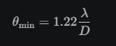

Увеличить разрешение можно, если увеличить диаметр объектива или уменьшить длину волны.

Голография — это способ записи и восстановления не только интенсивности, но и фазы световой волны. Благодаря этому можно получить объёмное изображение объекта. Голограмма получается в результате интерференции объектной и опорной волн. 

Объектный луч освещает объект, отраженная волна идет к фотоплатине. Опорный луч идет прямо на фотопластину. 

При освещении голограммы опорным лучом восстанавливается объёмное изображение объекта.

### 34. Дисперсия света

Дисперсия — это зависимость показателя преломления вещества от длины волны. Из-за этого белый свет в призме разлагается на спектр.

Свет разлагается на цвета, потому что разные цвета имеют разные длины волн. Например, красный λ ≈ 700 нм, фиолетовый λ ≈ 400 нм.

Обычно более короткие волны преломляются сильнее длинных. Поэтому фиолетовый свет отклоняется больше красного.

Первым подробно исследовал это явление Исаак Ньютон. Он пропустил солнечный свет через призму и получил спектр.

### 35. Электронная теория дисперсии света

Согласно электронной теории, под действием световой волны электроны в атомах начинают вынужденные колебания. Эти колебания изменяют скорость распространения света в веществе и тем самым показатель преломления.

Если частота света далека от собственной частоты электрона, электрон колеблется слабо. Если частота света близка к собственной, возникает резонанс и электрон начинает колебаться очень сильно. Из-за этого показатель преломления начинает сильно зависеть от частоты.

Разные цвета имеют разные частоты, поэтому электроны реагируют по-разному и скорость распространения света в веществе оказывается различной, а значит показатели преломления тоже.

Особенно сильная дисперсия наблюдается около собственных частот атомов и молекул. Теория хорошо объясняет нормальную и аномальную дисперсию.

Нормальная дисперсия:

λ↑⇒n↓

или

ν↑⇒n↑.

### 36. Поглощение (абсорбция) света. Закон Бугера

Поглощением (абсорбцией) света называется уменьшение интенсивности света при его прохождении через вещество вследствие превращения энергии световой волны во внутреннюю энергию вещества.

Бугер установил, что при прохождении одинаковых слоёв вещества интенсивность уменьшается в одинаковое число раз. Закон:

$$
I=I_0e^{-\alpha x}.
$$

где $I_0$ — начальная интенсивность, $I$ — интенсивность после прохождения слоя вещества, $\alpha$ — коэффициент поглощения, $x$ — толщина слоя.

Коэффициент поглощения зависит от вещества и длины волны света.

### 37. Эффект Доплера

Если источник и наблюдатель движутся друг относительно друга, наблюдаемая частота света изменяется. При сближении частота возрастает, при удалении уменьшается.

Источник испускает волны. Если источник стоит, расстояние между волнами одинаково. Если источник движется вперёд, то впереди волны сжимаются, а сзади растягиваются. Меняется длина волны. Если скорость волны постоянная, то уменьшение длины волны приводит к увеличению частоты.

Если источник приближается:

ν↑,λ↓.

Спектр смещается к фиолетовой области (фиолетовое смещение).

Если источник удаляется:

ν↓,λ↑.

Спектр смещается к красной области (красное смещение).

Эффект Доплера очень важен в астрофизике. По смещению спектральных линий определяют скорости звёзд, галактик и других космических объектов.

### 38. Излучение Черенкова-Вавилова

Это излучение возникает, когда заряженная частица движется в веществе со скоростью, превышающей скорость света в этом веществе. При этом возникает характерное голубоватое свечение.

Заряженная частица летит через вещество. Она возбуждает атомы среды. Если скорость частицы меньше скорости света в среде, световые волны успевают распространяться, ничего особенного. Если скорость частицы больше, то волны накладываются друг на друга и образуется световой контур, образуется голубоватое свечение.

Эффект используют в ядерной физике и физике элементарных частиц для регистрации быстрых заряженных частиц.

### 39. Естественный и поляризованный свет. Поляризация света при отражении и преломлении на границе двух диэлектриков. Угол Брюстера

Естественный свет содержит колебания во всех направлениях, перпендикулярных лучу. Поляризованный свет имеет определённое направление колебаний.

При отражении света от границы диэлектриков отражённый свет может стать частично или полностью поляризованным. 

Потому что колебания в разных направлениях отражаются по-разному. В результате одно направление колебаний "остается", а другое исчезает.

Поляризация света — это процесс упорядочения колебаний электромагнитных волн в пространстве.

Угол, при котором отражённый свет полностью поляризован, называется углом Брюстера. При угле Брюстера отражённый и преломлённый лучи взаимно перпендикулярны:

$$
\tan\theta_B=\frac{n_2}{n_1}
$$

где $\theta_B$ — угол Брюстера, n — показатель преломления среды.

Для воздуха и стекла:

$$
\tan\theta_B=n
$$

### 40. Двойное лучепреломление. Поляризационные призмы и поляроиды. Анализ поляризованного света

В некоторых кристаллах луч света расщепляется на два луча с разными свойствами — обыкновенный (подчиняется обычному закону преломления) и необыкновенный (подчиняется более сложным законам). Это явление называется двойным лучепреломлением.

Оно возникает, потому что в кристалле скорость света зависит от направления колебаний вектора E, поэтому естественный свет разделяется на два луча.

Возникает идея, можно ли один луч удалить, а второй оставить. Можно, использовав поляризационную призму. Самая известная — призма Николя. В ней удаляетеся обыкновенный луч. На выходе получается линейно поляризованный свет.

Поляризационная призма — устройство, преобразующее естественный свет в линейно поляризованный.

Поляроид работает как решётка. Он пропускает колебания только одного направления. Получается линейно поляризованный свет.

Для анализа поляризованного света используют второй поляроид. Он называется анализатор. Если оси совпадают, свет проходит. Если оси перпендикулярны, свет не проходит.

По изменению яркости определяют состояние поляризации.

Интенсивность света после анализатора подчиняется закону Малюса:

$$
I=I_0\cos^2\varphi.
$$

где $I_0$ — интенсивность до анализатора, $I$ — интенсивность после него, $\varphi$ — угол между плоскостями поляризации.

### 41. Искусственная оптическая анизотропия. Вращение плоскости поляризации

Слово "анизотропия" означает: свойства вещества зависят от направления.

Даже обычное изотропное вещество можно сделать анизотропным. Например, взять стекло: оно изотропно. Но если его сильно сжать или растянуть, то расположение молекул изменится. Вещество начнёт по-разному взаимодействовать со светом в разных направлениях. Появляется искусственная анизотропия.

Вызывается механическим напряжением (сжатие или растяжение), электрическим полем (эффект Керра), магнитным полем (эффект Коттона-Мутона)

Молекулы некоторых веществ имеют особое строение. Они по-разному взаимодействуют с различными составляющими поляризованной волны. В результате плоскость поляризации постепенно поворачивается. 

Вещества, способные вращать плоскость поляризации называются оптически активные вещества.

Направления колебаний поворачивается на некоторый угол $\varphi$

$$
\varphi=\alpha l
$$

где

$\varphi$ — угол поворота плоскости поляризации;

$\alpha$ — удельное вращение;

$l$ — длина пути света в веществе.

Для растворов:

$$
\varphi=\alpha lc
$$

где $c$ — концентрация раствора.

Такое вращение используют в поляриметрии, например для определения концентрации растворов сахара.

---
## Тема 4. Квантовая природа излучения

### 42. Тепловое излучение и его характеристики. Закон Кирхгофа

Тепловым излучением называется электромагнитное излучение, возникающее за счёт внутренней энергии тела.

Его основные характеристики: 
- энергетическая светимость (R), единица измерения - Вт/м2. Показывает сколько излучает единица поверхности за единицу времени.
- спектральная плотность энергетической светимости ($r_\lambda$). Показывает как энергия распределена по длинам волн

Абсолютно чёрное тело полностью поглощает всё падающее на него излучение независимо от длины волны.

Для него:

$$
A_\lambda = 1
$$

где $A_\lambda$ - поглощательная способность

Закон Кирхгофа утверждает, что отношение излучательной способности к поглощательной для всех тел одинаково при одной и той же температуре и равно соответствующей величине для абсолютно чёрного тела.

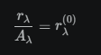

где $r_\lambda$ - спектральная плотность энергетической светимости тела, $A_\lambda$ - поглощательная способность, $r_\lambda^{(0)}$ - спектральная плотность энергетической светимости абсолютно чёрного тела.

### 43. Законы Стефана-Больцмана и смещения Вина. Формулы Рэлея—Джинса и Планка

Закон Стефана-Больцмана для абсолютно чёрного тела:

$$
R=\sigma T^4.
$$

где $R$ — энергетическая светимость, $\sigma$ — постоянная Стефана-Больцмана, $T$ — абсолютная температура.

Он показывает, что полная энергетическая светимость быстро растёт с температурой.

Закон смещения Вина:

$$
\lambda_{\max}T=b.
$$

где $\lambda_{\max}$ — длина волны, на которой излучение максимально, $b$ — постоянная Вина.

Он показывает, что максимум излучения при нагреве смещается к более коротким волнам.

Учёные пытались теоретически получить спектр теплового излучения.

Используя классическую физику, Рэлей и Джинс получили:

$$
r_\lambda=
\frac{8\pi ckT}{\lambda^4}
$$

где k — постоянная Больцмана, c — скорость света.

При $\lambda$ → 0 получается $r_\lambda$ → ∞. То есть теория предсказывает бесконечную энергию, что невозможно. Это назвали ультрафиолетовой катастрофой.

Чтобы устранить противоречие, Планк предположил: Энергия излучается не непрерывно, а порциями — квантами.

Энергия Кванта:

$$
E=h\nu
$$

где h - постонная Планка, $\nu$ - частота

На основе этой идеи Планк получил формулу:

$$
r_\lambda=
\frac{8\pi hc}
{\lambda^5}
\cdot
\frac{1}
{e^{\frac{hc}{\lambda kT}}-1}
$$

### 44. Оптическая пирометрия. Тепловые источники света

Оптическая пирометрия — это определение температуры нагретых тел по их излучению. Метод удобен, когда невозможно использовать обычный термометр.

Мы  уже знаем, что по закону Стефана-Больцмана, чем выше температура, тем интенсивнее излучение. И по закону Вина, чем выше температура, тем сильнее максимум спектра смещается к коротким волнам. Поэтому по излучению можно определить температуру.

Прибор оптический пирометр: внутри нить накала, ее яркость сравнивают с яркостью исследуемого тела, изменяют ток через лампу, пока яркости не станут одинаковыми.

Тепловыми источниками света называются источники, излучение которых возникает вследствие высокой температуры. Классический пример — лампа накаливания, где свет возникает из-за сильного нагрева нити.

### 45. Виды фотоэлектрического эффекта. Законы внешнего фотоэффекта. Уравнение Эйнштейна для внешнего фотоэффекта. Экспериментальное подтверждение квантовых свойств света. Применение фотоэффекта

Фотоэффект — это явление взаимодействия света с веществом, при котором под действием света освобождаются электроны.

Различают внешний фотоэффект, внутренний фотоэффект и вентильный фотоэффект. 

Внешний фотоэффект - под действием света электроны вылетают из вещества наружу.

Внутренний фотоэффект - электроны переходят в свободное состояние внутри самого вещества.

Вентильный фотоэффект - Возникает ЭДС под действием света.

На катод падает свет, из катода вылетают электроны. Если подключить напряжение, электроны попадают на анод и возникает фототок

Законы Столетова:

1. Фототок насыщения пропорционален интенсивности света.

$$
I_{\text{ф}} \propto I_{\text{света}}
$$

То есть:

чем больше света падает,

тем больше выбивается электронов.

2. Максимальная кинетическая энергия фотоэлектронов зависит не от интенсивности света, а от его частоты.

$$
E_{k,\max} \propto \nu
$$

3. Для каждого вещества существует красная граница фотоэффекта.

$$
\nu \ge \nu_0
$$

где $\nu_0$ — пороговая частота, $\lambda_0$ — красная граница фотоэффекта.

Красная граница - минимальная частота или максимальная длина волны, при которой фотоэффект ещё возможен.

Эйнштейн предположил, что свет состоит из отдельных квантов (фотонов). Каждый фотон несет энергию (E = h $\nu$)

Уравнение Эйнштейна для внешнего фотоэффекта:

$$
h\nu=A_{\text{вых}}+\frac{mv_{\max}^2}{2}.
$$

где $h$ — постоянная Планка, $\nu$ — частота света, $A_{\text{вых}}$ — работа выхода, $m$ — масса электрона, $v_{\max}$ — максимальная скорость фотоэлектрона.

Энергия фотона расходуется на работу выхода и кинетическую энергию электрона.

Красная граница:

$$
\nu_0=\frac{A_{\text{вых}}}{h}
$$

или

$$
\lambda_0=\frac{hc}{A_{\text{вых}}}
$$

Фотоэффект стал прямым подтверждением квантовой природы света. Его используют в фотоэлементах, датчиках, автоматике и солнечных батареях.

### 46. Энергия и импульс фотона. Давление света

Фотон обладает энергией

$$
E=h\nu=\frac{hc}{\lambda},
$$

где $E$ — энергия фотона, $h$ — постоянная Планка, $\nu$ — частота, $c$ — скорость света, $\lambda$ — длина волны.

Если частота больше, то энергия фотона больше.

и импульсом

$$
p=\frac{h}{\lambda}.
$$

где $p$ — импульс фотона.

Чем меньше длины волны, тем больше импульс фотона.

Так как свет переносит импульс, он оказывает давление на поверхность. Давлением света называется давление, возникающее при передаче импульса фотонов поверхности.

Падает фотон, поверхность его поглощает. Тогда импульс передается поверхности. Если фотон отражается то изменение импульса еще больше, поэтому давление больше.

Формулы давления света

Полностью поглощаемая поверхность:

$$
P=\frac{I}{c}
$$

где P — давление света, I — интенсивность света.

Полностью отражающая поверхность

$$
P=\frac{2I}{c}
$$

Двойка, потому что импульс меняет направление на противоположное.

Давление света используется в астофизике, лазерных технологиях, солнечных парусах.

### 47. Эффект Комптона и его элементарная теория

Эффект Комптона — увеличение длины волны рентгеновского или гамма-излучения при его рассеянии на свободных или слабо связанных электронах.

Комптон преположил: фотон ведет себя как частица.

У фотона есть энергия и есть импульс:

$$
p=\frac{h}{\lambda}
$$

При столкновении часть энергии фотон передает электрону, поэтому энергия фотона уменьшается. А поскольку

$$
E=\frac{hc}{\lambda},
$$

то уменьшение энергии означает, что $\lambda$ увеличивается.

Формула Комптона:

$$
\Delta\lambda=
\lambda'-\lambda=
\frac{h}{m_ec}
(1-\cos\theta)
$$

где $\lambda$ - длина волны до столкновения, $\lambda'$ - после столкновения, $m_e$ - масса электрона, $\theta$ - угол рассеяния фотона.

Величина

$$
\frac{h}{m_ec}
$$

называется комптоновской длиной волны электрона.

Тогда формулу удобно записать так:

$$
\Delta\lambda=
\lambda_C(1-\cos\theta)
$$

Эффект нельзя объяснить только волновой моделью света. Он прямо подтверждает, что фотон ведёт себя как частица с энергией и импульсом.

### 48. Единство корпускулярных и волновых свойств электромагнитного излучения

Свет нельзя считать только волной или только потоком частиц. Он обладает одновременно и волновыми, и корпускулярными свойствами.

Свет проявляет волновые свойства в интерференции (две волны складываются), дифракции(волна огибает препятствие), поляризации, дисперсии. Но в фотоэффекте и эффекте Комптона он проявляет корпускулярные свойства.

Волновую теорию развивали Гюйгенс, Юнг, Максвелл. Она гласила: свет - электромагнитная волна.

Планк предположил: энергия излучается квантами.

Эйнштейн сделал следующий шаг: свет состоит из фотонов.

Фотон имеет энергию и импульс. Фотоэффект и эффект Комптона полностью подтвердили это.

Поэтому современная физика рассматривает электромагнитное излучение как объект двойственной природы. В зависимости от опыта на первый план выходят либо волновые, либо квантовые свойства.

---

## Тема 5. Элементы квантовой физики

### 49. Модели атома Томсона и Резерфорда

Все знали, что атом нейтрален, а после открытия электрона стало ясно, что внутри атома есть отрицательные заряды. Но как они расположены — никто не понимал.

После открытия электрона Томсон предложил первую модель атома.

Атом представляет собой положительно заряженный шар. Внутри этого шара находятся электроны (-).

Часто её называют моделью «пудинга с изюмом».

Модель объясняла электрическую нейтральность атома и существование электронов, но не подтверждалать экспериментально.

Резерфорд исследовал прохождение α-частиц через тонкую золотую фольгу. Если модель Томсона верна, то частицы должны были проходить почти прямо.

Результаты опыта:

- Большинство частиц действительно проходило прямо
- Некоторые немного отклонялись
- Но небольшая часть частиц отражалась назад

Вывод Резерфорда:

Такое возможно только если:

- Почти вся масса атома сосредоточена в очень маленькой области
- Весь положительный заряд тоже сосредоточен там

Эта область получила название атомное ядро.

Модель атома Резерфорда:

Атом состоит из:

1. маленького положительно заряженного ядра;
2. электронов, движущихся вокруг ядра.

Эту модель называют планетарной моделью атома.

Недостаток модели Резерфорда

По законам электродинамики Максвелла: движущийся с ускорением заряд должен излучать энергию.

Электрон движется по окружности, значит имеет ускорение. Следовательно, электрон излучает энергию, теряет скорость и падает на ядро. Но реальные атомы устойчивы. Кроме того, модель Резерфорда не объясняла линейчатые спектры атомов.

Эту проблема позже решил Бор.

### 50. Линейчатый спектр атома водорода. Постулаты Бора. Опыты Франка и Герца

Когда через водород пропускают электрический разряд, он начинает светиться. Если этот свет разложить призмой, то получится не сплошной спектр, а отдельные линии. Такой спектр называется линейчатым.

Линейчатый спектр состоит из отдельных спектральных линий определённых длин волн.

Возник вопрос: Почему атом излучает только определённые длины волн? Модель Резерфорда этого объяснить не могла.

Формула Бальмера:

Для видимой части спектра водорода

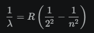

где R - постоянная Ридберга, n - номер энергетического уровня, с которого электрон переходит на второй уровень атома водорода = 3,4,5...

Но эта формула была чисто экспериментальной. Нужно было объяснить её физически.

Бор предложил новую модель атома.

1. Первый постулат Бора

Электрон может двигаться только по определённым стационарным орбитам. На этих орибах он не падает на ядро и не излучает энергию.

2. Второй постулат Бора

Излучение или поглощение света происходит только при переходе между орбитами.

Если электрон переходит с верхней орбиты на нижнюю, то испускается фотон. Если с нижней на верхнюю, то поглощается фотон.

Энергия фотона:

$$
h\nu=E_i-E_k
$$

где $E_i$ -энергия начального состояния, $E_k$ - энергия конечного состояния.

Квантование момента импульса:

$$
mvr=n\hbar
$$

где n = 1,2,3..., $\hbar$ - сокращенная постоянная Планка.

Поэтому электрон может находиться только на определённых стационарных орбитах.

Эта модель хорошо работала только для атома водорода, позже ее заменила квантовая механика.

Опыты Франка и Герца

Эксперимент доказал существование дискретных энергетических уровней.

Схема опыта:

Электроны разгонялись электрическим полем и сталкивались с атомами ртути. Если энергии электрона недостаточно, то энергия не теряется. Но при определенной энергии электрон отдает энергию атому и атом возбуждается. После этого ток резко уменьшался.

Главный результат: атом может получать энергию не любую, а только определёнными порциями. Это означает, что энергетические уровни атома дискретны.

### 51. Спектр атома водорода по Бору

Бор предположил:

1. Электрон может находиться только на определённых орбитах.
2. Каждой орбите соответствует определённая энергия.
3. При движении по орбите электрон не излучает энергию.
4. Энергия излучается только при переходе между орбитами.

Водород имеет набор разрешённых энергий:

n = ∞

n = 4

n = 3

n = 2

n = 1

где n - главное квантовое число, n=1 - основное состояние, n = 2,3,4... - возбужденные состояния

Если электрон переходит сверху вниз:

n = 3
  ↓
n = 2

то испускается фотон.

Энергия фотона:

$$
h\nu = E_i - E_k
$$

Почему появляются линии?

Каждый переход даёт свою энергию фотона. Например: 3 → 2, 4 → 2, 5 → 2

Для каждого перехода разная энергия, следовательно разная частота и разная длина волны. Поэтому вместо сплошного спектра появляются отдельные линии.

Формула Бора для энергии уровней

Энергия электрона в атоме водорода:

$$
E_n=-\frac{13.6}{n^2}\,\text{эВ}
$$

Чем больше n, тем ближе энергия к нулю

Серии спектра водорода

1. Серия Лаймана. Все переходы заканчиваются на n=1 (Ультрафиолет)
2. Серия Бальмера. Все переходы заканчиваются на n=2 (Видимый свет)
3. Серия Пашена. Все переходы заканчиваются на n=3 (Инфракрасная область)

Бор из своей модели получил формулу 

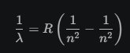

И таким образом вывел формулу Ридберга.

### 52. Корпускулярно-волновой дуализм свойств вещества. Некоторые свойства волн де Бройля

Уже выяснилось, что свет считали волной, но оказалось, что он обладает свойствами частиц

Тогда французский физик де Бройль задал вопрос: Если волна может вести себя как частица, может ли частица вести себя как волна?

Он преположил, что любой движущейся частице соответствует волна.

Гипотеза де Бройля:

Каждой частице с импульсом p соответствует волна длины

$$
\lambda=\frac{h}{p}
$$

Если частица движется медленно (p = mV), то

$$
\lambda=\frac{h}{mv}
$$

Чем больше импульс частицы, тем меньше длина волны де Бройля.

Согласно де Бройлю:

Каждая частица обладает одновременно корпускулярными и волновыми свойствами.

Например, электрон, как частица, имеет массу, заряд, импульс. Как волна, интерферирует, дифрагирует.

Некторые свойства волн де Бройля:

1. Волны существует для любых частиц
2. Длина волны обратно пропорциональна импульсу
3. Для макроскопических тел волна практически не наблюдается
4. Для микрочастиц волна заметна

### 53. Соотношение неопределенностей

В квантовой механике нельзя одновременно очень точно определить координату и импульс частицы.

Если волна бесконечно длинная, то невозможно сказать где она находится. Если волна локализована, то ее положение известно лучше, но длина волны и, следовательно, импульс становится неопределенным.

Соотношение неопределённостей Гейзенберга:

$$
\Delta x\,\Delta p_x\ge \frac{\hbar}{2}.
$$

где $\Delta x$ — неопределённость координаты, $\Delta p_x$ — неопределённость импульса, $\hbar$ — приведённая постоянная Планка.

Если очень точно определить координату (Δx→0), то Δp становится большой. Если точно известен импульс (Δp→0), то Δx становится большой. То есть одновременно точно знать и координату, и импульс нельзя.

Это фундаментальное свойство микромира, а не просто недостаток приборов.

Есть и аналогичное соотношение для энергии и времени. 

$$
\Delta E\,\Delta t
\ge
\frac{\hbar}{2}
$$

Чем меньше время существования состояния, тем менее точно определена его энергия.

### 54. Волновая функция и ее статистический смысл. Общее уравнение Шредингера. Уравнение Шредингера для стационарных состояний

После гипотезы де Бройля выяснилось: электрон обладает волновыми свойствами. Возник вопрос: Что именно колеблется в этой волне?

Поэтому Шрёдингер ввёл специальную функцию $\psi(x,y,z,t)$ которая называется волновой функцией.

Она описывает квантовое состояние частицы. Сама по себе физического смысла не имеет.

Физический смысл имеет величина $|\psi|^2$. Она показывает вероятность обнаружить частицу в данной точке пространства.

Если $|\psi|^2$ большое, то электрон там находится с большой вероятностью.

Если $|\psi|^2=0$, то электрон там обнаружить нельзя.

Борн предложил:

$$
w=|\psi|^2
$$

где $w$ - плотность вероятности

Частица где-то обязательно должна находиться. Поэтому сумма вероятностей во всём пространстве должна быть равна единице:

$$
\int |\psi|^2\,dV=1
$$

где $dV$ - элемент объёма, очень маленький кусочек пространства.

Общее (нестационарное) уравнение Шрёдингера

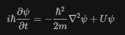

где $i$ - мнимая единица, $m$ - масса частицы, $U$ - потенциальная энергия, $\nabla$ - оператор Лапласа, $\hbar$ - приведённая постоянная Планка.

Оно позволяет найти: $\psi(x,y,z,t)$ то есть узнать, как меняется квантовое состояние частицы со временем.

Часто потенциальная энергия не зависит от времени. Тогда сущетсвует стационарные состояния ($E = const$)

Уравнение Шрёдингера для стационарных состояний:

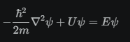

Именно из него получают энергетические уровни атома водорода, орбитали атомов, распределение электронов. То есть оно заменило модель Бора.

### 55. Принцип причинности в квантовой механике. Движение свободной частицы

В квантовой механике причинность сохраняется, но предсказания носят вероятностный характер. Мы не говорим о точной классической траектории частицы, а вычисляем вероятность.

Для электрона нельзя одновременно точно знать x и p из-за соотношения неопределенностей:

$$
\Delta x\,\Delta p_x\ge \frac{\hbar}{2}.
$$

В квантовой механике причинность сохраняется, но в другой форме. Если известна волновая функция: $\psi(x,y,z,t)$ то уравнение Шрёдингера однозначно определяет $\psi(x,y,z,t)$ в любой следующий момент времени. Но вероятностно.

Свободная частица — это частица, на которую не действуют силы.

Для нее потенциальной энергии нет. $U=0$

Тогда стационарное уравнение Шрёдингера становится:

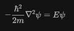

Получается волна де Бройля:

$$
\psi=Ae^{i(kx-\omega t)}
$$

где $A$ - амплитуда, $k$ - волновое число, $\omega$ - циклическая частота, $e$ - число Эйлера. 

Это называется плоской волной.

Формула показывает: свободная частица описывается волной, распространяющейся в пространстве.

Для свободной частицы:

$$
\lambda=\frac{h}{p}
$$

Поэтому электрон движется как волна де Бройля.

### 56. Частица в одномерной прямоугольной «потенциальной яме» с бесконечно высокими «стенками»

Потенциальная яма с бесконечно высокими стенками – ограниченная область пространства с пониженной потенциальной энергией частицы, где на границах потенциальная энергия возрастает до бесконечности.

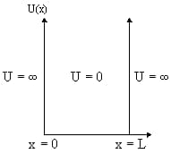

Частица заперта в некоторой области пространства и не может выйти наружу.

Раз электрон — волна, то его волна должна помещаться между стенками. Поэтому разрешены только некоторые волны.

И тут появляется квантование. Разрешены только некоторые волны → Разрешены только некоторые длины волн → Разрешены только некоторые импульсы → Разрешены только некоторые энергии

Поэтому получается E₁, E₂, E₃. А вот так нельзя - 1.4E₁, 2.8E₁. То есть энергия квантована.

В яме должно укладываться целое число полуволн:

$$
\lambda_n=\frac{2L}{n}
$$

где n = 1 (одна полуволна),2 (две полуволны),3...

Энергия частицы:

$$
E_n=
\frac{n^2h^2}
{8mL^2}
$$

где $m$ — масса частицы, $L$ — ширина потенциальной ямы, $n$ — номер энергетического уровня.

Это один из самых важных примеров в квантовой механике. Он показывает, что ограничение области движения автоматически приводит к дискретному спектру энергии.

### 57. Прохождение частицы сквозь потенциальный барьер. Туннельный эффект

В квантовой механике частица имеет ненулевую вероятность пройти через барьер даже тогда, когда её энергия меньше высоты барьера (так как электрон - это волна, и она не обрывается мгновенно). Это называют туннельным эффектом.

Вероятность прохождения зависит от высоты барьера, ширины барьера, энергии частицы.

Эффект невозможен в классической физике. Он важен для альфа-распада, туннельных диодов, сканирующего туннельного микроскопа и многих явлений в физике твёрдого тела.

### 58. Линейный гармонический осциллятор в квантовой механике

Линейный гармонический осциллятор представляет собой частицу, движущуюся в поле с потенциальной энергией

$$
U=\frac{kx^2}{2}
$$

Энергия частицы квантуется. Разрешены не любые энергии. Только такие:

$$
E_n=
\left(
n+\frac12
\right)
\hbar\omega
$$

где n = 0,1,2,3..., $\omega$ - циклическая частота колебаний

В потенциальной яме энергия была E₁​,E₂​,… Здесь тоже E₀, E₁, E₂... Но расстояние между уровнями одинаково:

$$
\Delta E=\hbar\omega
$$

Это особенность гармонического осциллятора.

В классической физике можно остановить грузик, тогда E=0. В квантовой механике так нельзя. Для самого нижнего уровня n=0 энергия не будет нулевой. Потому что нарушился бы принцип неопределенности:

$$
\Delta x\,\Delta p_x\ge \frac{\hbar}{2}.
$$

### 59. Атом водорода в квантовой механике. 1s-состояние электрона в атоме водорода

Бор предполагал: электрон летает по орбитам вокруг ядра.

Но после появления уравнения Шрёдингера оказалось: нельзя говорить о точной траектории электрона. Из-за соотношения неопределённостей:

$$
\Delta x\,\Delta p_x\ge \frac{\hbar}{2}.
$$

Нельзя одновременно точно знать координату и импульс.

Атом водорода в квантовой механике

Рассматривается система:

протон (+)
электрон (-)

Для электрона записывают стационарное уравнение Шрёдингера:

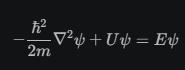

Решая его, получают:

- разрешённые энергии
- волновые функции
- распределение вероятности электрона

У Бора: электрон движется по орбите

В квантовой механике: орбиты нет, есть орбиталь

Орбиталь — область пространства, где вероятность обнаружения электрона велика.

То есть это не траектория. Это облако вероятности.

При решении уравнения Шрёдингера появляются квантовые числа. Главное квантовое число: n = 1,2,3... Оно определяет энергию, размер орбитали

Энергия водорода

Получается та же формула, что и у Бора:

$$
E_n=
-\frac{13.6}{n^2}\,\text{эВ}
$$

1s-состояние - Самое нижнее энергетическое состояние атома. Здесь n = 1. 1s означает основное состояние атома водорода.

1s орбиталь имеет сферическую симметрию. Ядро находится в центре. То есть электронное облако имеет форму шара.

Она означает, что в разных точках пространства вероятность обнаружения электрона различна.

Для состояния 1s максимальная вероятность находится вблизи ядра.

Энергия основного состояния равна E1​=−13.6 эВ. Соответствует наименьшей энергии электрона.

### 60. Спин электрона. Спиновое квантовое число

Когда начали изучать спектры атомов более точно, оказалось, что модель Бора + уравнение Шрёдингера не объясняют некоторые тонкие особенности спектров.

Спин — это собственный момент импульса электрона, не связанный с его движением в пространстве, определяющий его магнитные свойства.

Орбитальный момент импульса - связан с движением вокруг ядра, собственный - связан с внутренним свойством самого электрона.

Для описания спина вводится квантовое число:

$$
s=\frac12.
$$

где $s$ — спиновое квантовое число электрона.

Спин может иметь две ориентации. Поэтому вводят проекцию спина:

$$
m_s=\pm\frac12
$$

То есть, у электрона есть собственный магнитный момент. Во внешнем магнитном поле возможны только две ориентации.

В атоме не могут находиться два электрона с одинаковым набором квантовых чисел. Поэтому на одной орбитали может быть максимум 2 электрона. Один со спином $+1/2$, другой $-1/2$.

### 61. Принцип неразличимости тождественных частиц. Фермионы и бозоны

У электронов абсолютно одинаковые масса, заряд, спин и все внутренние свойства. В квантовой механике считается, что все электроны абсолютно неразличимы.

То же самое относится к протонам, нейтронам и фотонам.

Принцип неразличимости: При перестановке двух одинаковых частиц физическое состояние системы не изменяется.

Оказалось, что все элементарные частицы делятся на два класса: фермионы и бозоны

Фермионы — частицы с полуцелым спином: $S = 1/2, 3/2, 5/2..$. Примеры: электрон, протон, нейтрон.

Главное свойство фермионов: Подчиняются принципу Паули. То есть два одинаковых фермиона не могут находиться в одном квантовом состоянии.

Бозоны — частицы с целым спином: $S = 0, 1, 2..$. Примеры: фотон, глюон, бозон Хиггса.

Главное свойство бозонов: Они не подчиняются принципу Паули. Поэтому множество бозонов может находиться в одном и том же состоянии. Например, фотоны могут иметь одинаковую энергию и направление движения.

### 62. Принцип Паули. Распределение электронов в атоме по состояниям

Формулировка: В атоме не может существовать двух электронов с одинаковым набором всех четырёх квантовых чисел.

То есть для двух электронов должны отличаться хотя бы одно из:

- главное квантовое число $n$ (определяет энергетический уровень и размер орбитали);
- орбитальное квантовое число $l$ (определяет форму орбитали и подуровень);
- магнитное квантовое число $m$ (определяет конкретную орбиталь внутри подуровня и ориентацию орбитали в пространстве);
- спиновое квантовое число $m_s$ (определяет спиновую ориентацию спина электрона).

Два можно, потому что их спины разные:

$$
m_s=\pm\frac12
$$

Распределение электронов по состояниям

Электроны занимают уровни энергии начиная с самых низких. То есть сначала заполняется 1s, потом 2s, потом 2p

Вместимость подуровней:

1. s-подуровень - 1 орбиталь, максимум 2 электрона
2. p-подуровень - 3 орбитали, максимум 6 электронов
3. d-подуровень - 5 орбиталей, максимум 10 электронов
4. f-подуровень - 7 орбиталей, максимум 14 электронов

Примеры распределения:

Водород - 1 электрон - 1s¹

Гелий - 2 электрона - 1s² (орбиталь полностью заполнена)

Литий - 3 электрона - 1s² 2s¹

n=1 → s

n=2 → s p

n=3 → s p d

n=4 → s p d f

### 63. Периодическая система элементов Менделеева

Дмитрий Менделеев расположил химические элементы в таблицу так, что их свойства периодически повторяются.

Например: Li  Na  K имеют похожие свойства.

Почему свойства элементов повторяются? 

Каждый следующий элемент отличается от предыдущего на один протон в ядре и один электрон в оболочке.

Например,

H  → 1 электрон

He → 2 электрона

Li → 3 электрона

Be → 4 электрона

Электроны распределяются по состояниям согласно принципу минимума энергии и принципу Паули.

Сначала заполняются уровни с меньшей энергией.

Например, Литий: 1s² 2s¹

Почему свойства повторяются? Химические свойства определяются не всеми электронами, а внешними (валентными).

Например, Литий: 1s² 2s¹, Натрий: 1s² 2s² 2p⁶ 3s¹, Калий: ... 4s¹. У всех один внешний электрон: s¹. Поэтому их свойства похожи.

Горизонтальные строки таблицы называются периодами. При движении слева направо заполняется один и тот же энергетический уровень.

Вертикальные столбцы называются группами. У элементов одной группы одинаковое число внешних электронов. Поэтому их свойства похожи.

Современная формулировка периодического закона: Свойства химических элементов и их соединений периодически повторяются с увеличением заряда атомного ядра.

### 64. Молекулы: химические связи, понятие об энергетических уровнях

Молекула — это устойчивая система из двух или нескольких атомов.

Например: H₂, O₂, H₂O

Химическая связь — это взаимодействие между атомами, удерживающее их вместе в молекуле

Почему связь возникает? Рассмотрим два атома водорода.

Когда они далеко, почти не взаимодействуют. Когда начинают сближаться, между ядрами и электронами возникают электрические силы. В результате система может перейти в состояние с меньшей энергией. А любая система стремится к минимуму энергии. Поэтому образуется молекула.

Чтобы разорвать молекулу, нужно затратить энергию. Эта энергия называется энергией связи. Чем больше энергия связи, тем прочнее молекула.

В молекуле тоже существуют уровни энергии. Но их больше, чем в атоме.

Энергетические уровни молекулы — это строго определенные (дискретные) значения энергии, которыми может обладать квантовая система, состоящая из связанных атомов.

Выделяют три типа движения:

1. Электронное движение

Электроны движутся около ядер. Получаются электронные уровни: E₁, E₂, E₃. Переходы между ними дают видимый свет, ультрафиолет

2. Колебательное движение

Атомы в молекуле колеблются. Для колебаний тоже существуют квантованные уровни: v=0, v=1, v=2

3. Вращательное движение

Молекула может вращаться. Для вращения также существуют уровни: J=0, J=1, J=2

Иерархия уровней:

- Самые большие расстояния между уровнями: электронные
- Меньше: колебательные
- Самые маленькие: вращательные

### 65. Молекулярные спектры. Комбинационное рассеяние света

В молекуле существуют уровни энергии (электронные, колебательные, вращательные). Поскольку энергия квантована, молекула может поглощать или излучать свет только определённых частот.

При переходе между уровнями выполняется условие:

$$
h\nu=E_2​−E_1​
$$

То есть энергия фотона равна разности уровней энергии.

Спектр — это набор частот (или длин волн), которые поглощает или излучает вещество.

Для атомов спектр линейчатый. Для молекул спектр гораздо сложнее, потому что есть сразу 3 типа уровней.

Каждый электронный уровень разбивается на колебательные. Каждый колебательный — на вращательные. Поэтому вместо одной линии получается группа линий.

Виды молекулярных спектров:

1. Вращательные. Наименьшие энергии переходов. Обычно находятся в микроволновой области.

2. Колебательные. Наблюдаются в инфракрасной области.

3. Электронные. Связаны с переходами электронов между уровнями. Наблюдаются в видимом свете и ультрафиолете.

Комбинационное рассеяние света — это процесс неупругого рассеяния света молекулами вещества. При взаимодействии фотона с веществом меняется его частота (энергия): часть энергии фотона передается молекуле, заставляя ее колебаться, либо молекула отдает свою энергию фотону.

Во время рассеяния молекула меняет своё колебательное или вращательное состояние. Поэтому энергия фотона после рассеяния становится другой.

### 66. Поглощение. Спонтанное и вынужденное излучения

Представим атом. Электрон находится на нижнем уровне. На атом падает фотон. Если энергия фотона точно равна разности уровней:

$$
h\nu=E_2​−E_1​
$$

то атом может поглотить этот фотон.

После поглощения электрон переходит вверх. Это называется поглощением.

Поглощение — процесс перехода атома из состояния с меньшей энергией в состояние с большей энергией за счёт поглощения фотона.

Спонтанное излучение — самопроизвольный переход атома с более высокого энергетического уровня на более низкий с испусканием фотона.

Испускаемые фотоны возникают случайно. Поэтому обычная лампа светит хаотично.

Вынужденное излучение. 

Пусть электрон уже находится на уровне E₂. На атом налетает фотон с энергией $h\nu=E_2-E_1$. Он заставляет электрон перейти вниз раньше времени. При переходе испускается ещё один фотон. Испущенный фотон полностью повторяет падающий.

Вынужденное излучение — это процесс, при котором возбужденный атом или молекула испускает фотон под воздействием другого (внешнего) фотона.

### 67. Оптические квантовые генераторы (лазеры)

Лазер (оптический квантовый генератор) — устройство, которое создаёт свет за счёт вынужденного излучения.

Любой лазер содержит три элемента:

1. Активная среда

Вещество, атомы которого будут излучать свет. Например, газ (гелий-неон), рубиновый кристалл.

2. Источник накачки

Нужно перевести атомы в возбуждённое состояние. Это называется накачка. Источник нобходим для передачи энергии внешней среды в активное вещество лазера. Может использоваться электрический разряд или другой лазер. 

3. Оптический резонатор

Обычно это два зеркала. Свет многократно отражается между зеркалами. Резонатор направляет и удерживает свет внутри лазера, заставляя его многократно проходить через активную среду.

В обычном веществе: нижний уровень - электронов много, верхний уровень - электронов мало. Тогда поглощение сильнее излучения.

Для работы лазера нужно наоборот: верхний уровень - электронов много, нижний уровень - электронов мало.

Это называется: инверсная населённость уровней.

Свойства лазерного излучения:

1. Монохроматичность. Практически одна длина волны (один цвет).

2. Когерентность. Одинаковая фаза волн.

3. Направленность. Луч почти не расходится.

4. Высокая интенсивность. Большая энергия в малом объёме.

Лазеры применяются в медицине, измерительной технике, промышленной резке материалов, голографии, лазерных принтерах.